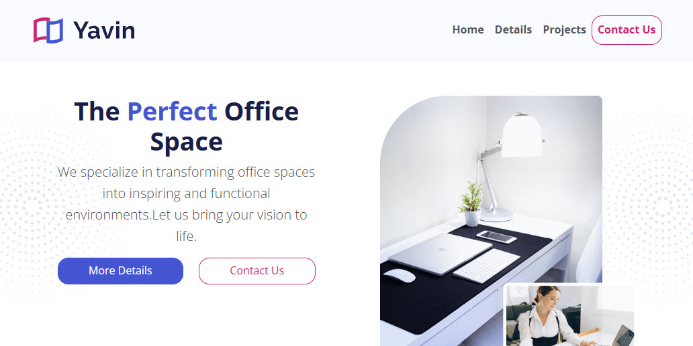

# Yavin_Office_Design
Project 4 for 'Bootstrap 5 From Scratch' - Packt

https://ramirezjm.github.io/Yavin_Office_Design/index.html

[](https://choosealicense.com/licenses/mit/)


<div>
  
</div>

1. Clone the repository

  ```bash
   git clone https://github.com/ramirezjm/Yavin_Office_Design.git
   cd Yavin_Office_Design
```

2. Install dependencies

```bash
npm install
```

3. Start watch mode to compile sass
```bash
npm run watch:css
```

4.Run the build
```bash
npm run build:css
```
--> the build process includes purgecss, which removes unused bootstrap classes, reducing the final size of styles.css by about 90%.


